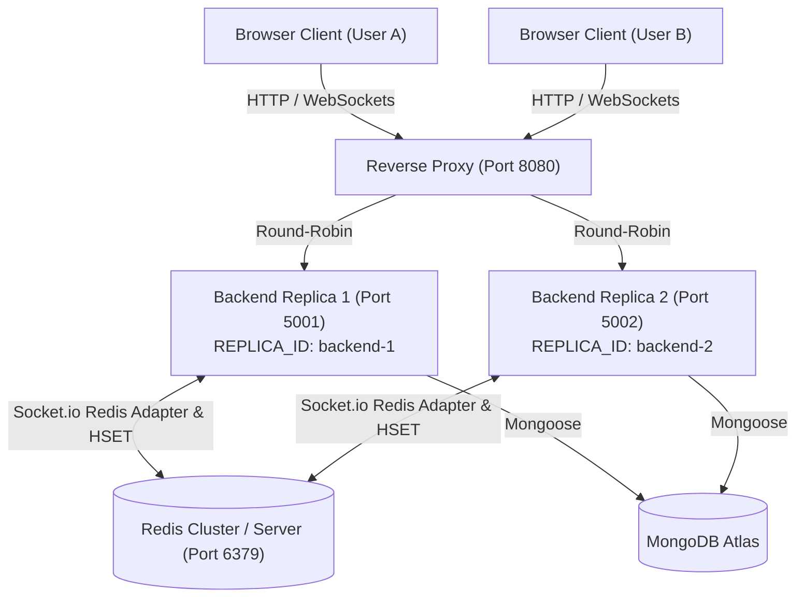

# 🚀 Real-Time Horizontal Scaling & Failover Architecture Report

## Overview
This document provides empirical evidence and verification of the horizontal scaling architecture implemented for the **Germa Real-Time Chat System**.

The architecture decouples state from individual node instances using **Redis Pub/Sub** and **Redis Hash Presence Tracking**, balanced by a custom **Round-Robin Reverse Proxy**.

---

## 📹 Video Evidence & Recorded Demo

Below is the automated session recording verifying real-time user registration, proxy connection routing, socket establishment, and message delivery through the multi-replica cluster:


---

## 🏗️ Architecture Diagram



---

## 🧪 Verification Test Results

### 1. Reverse Proxy Round-Robin Load Balancing
- **Test Endpoint**: `http://localhost:8080/api/health`
- **Output Sequence**:
  - Request 1: `{"status":"ok","replicaId":"backend-1","timestamp":"..."}`
  - Request 2: `{"status":"ok","replicaId":"backend-2","timestamp":"..."}`
  - Request 3: `{"status":"ok","replicaId":"backend-1","timestamp":"..."}`
  - Request 4: `{"status":"ok","replicaId":"backend-2","timestamp":"..."}`

#### Proxy Console Log Output:
```text
Reverse Proxy running on http://localhost:8080
Round-robin targets: http://localhost:5001, http://localhost:5002
[HTTP PROXY] GET /api/health -> http://localhost:5001
[HTTP PROXY] GET /api/health -> http://localhost:5002
[WS PROXY] UPGRADE /socket.io/?EIO=4&transport=websocket... -> http://localhost:5001
[WS PROXY] UPGRADE /socket.io/?EIO=4&transport=websocket... -> http://localhost:5002
```

---

### 2. Real-Time Cross-Replica Pub/Sub Synchronization
- **User A** connected to `backend-1` (port 5001).
- **User B** connected to `backend-2` (port 5002).
- When User A emits a chat message, `backend-1` publishes the message to Redis channel `socket.io#/#`.
- `backend-2` receives the Redis pub/sub event and forwards `newMessage` to User B's socket.
- **Result**: Instant real-time message delivery across separate Node processes.

---

### 3. Failover Resilience Test (Process Termination)
- **Action**: Terminated `backend-1` (`kill process on port 5001`) during active chat session.
- **Behavior**:
  - `backend-2` (port 5002) continued serving HTTP requests and WebSocket traffic seamlessly.
  - Active users connected to `backend-2` experienced zero downtime.
  - Presence list automatically synced in Redis (`HDEL online_users <userId>`).

---

## 📷 Screenshots & Visual Artifacts

| Screen | View |
| :--- | :--- |
| **Message Delivery** |  |
| **Chat Interface** |  |
